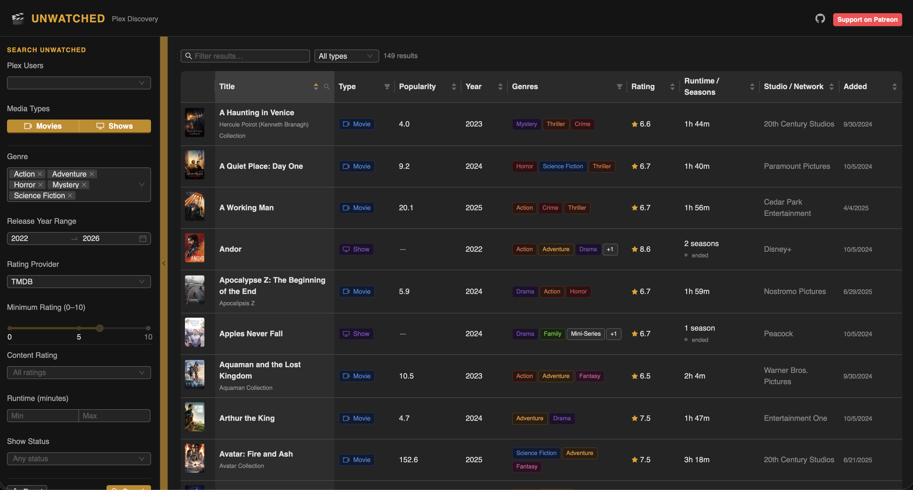
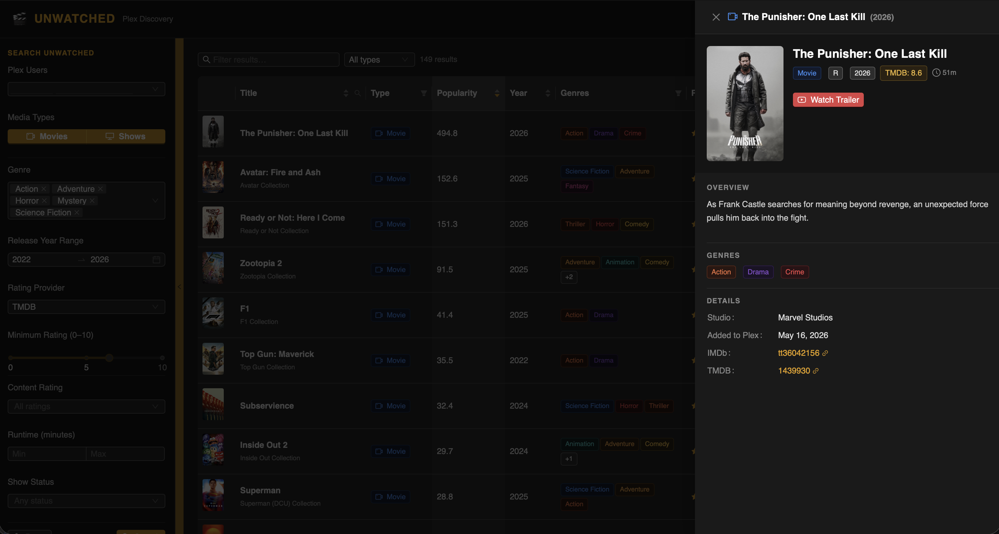

<div align="center">

# 🎬 UNWATCHED
### Plex Discovery — Find what nobody has seen yet

**Unwatched** is a self-hosted dark-mode web app that cross-references your **Radarr**, **Sonarr**, and **Tautulli** libraries to surface movies and TV shows that one or more of your Plex users haven't watched yet.

[](https://patreon.com/NRCOM)
[](https://github.com/orgs/NRCOM/Unwatched)

</div>

---

<p align="center">
    
    
</p>

---

## ✨ Features

- **Multi-user watch filtering** — select one or more Plex users; only content unwatched by *all* selected users is returned
- **Movies & TV shows** — pulls your full Radarr and Sonarr libraries in one view
- **Rich filters** — genre, release year range, rating provider (TMDB / IMDb / Rotten Tomatoes / Metacritic / TVDB), content rating, runtime, and show status
- **Sortable, filterable table** — sort by title, year, popularity, rating, runtime, studio/network, or date added
- **Detail drawer** — click any row for a full metadata panel with ratings, runtime, trailer link, overview, and external links (IMDb, TMDB, TVDB)
- **Persistent search state** — filter selections are saved across page refreshes; only cleared when you hit Reset
- **Collapsible sidebar** — collapse the search panel for a full-width results view with a single click
- **Poster images** — proxied server-side so API keys are never exposed to the browser
- **Dark mode** — built on Ant Design v5 with a Plex-inspired dark theme throughout
- **Cloudflare Access support** — optional service token authentication for instances behind Cloudflare Zero Trust
- **Single-container deployment** — the production image serves the React frontend and Express API together

---

## 🖥️ Tech Stack

| Layer | Technology |
|---|---|
| Frontend | React 18, Vite 5, Ant Design 5 |
| Backend | Node.js, Express 4, Axios |
| Data sources | Radarr v3 API, Sonarr v3 API, Tautulli API v2 |
| Infrastructure | Docker, Docker Compose, GHCR |

---

## 🚀 Getting Started

### Prerequisites

- [Docker](https://docs.docker.com/get-docker/) and Docker Compose
- A running **Radarr**, **Sonarr**, and **Tautulli** instance
- API keys for each service

### Community Install: Docker Compose

Create a `compose.yml` file anywhere on your server:

```yaml
services:
    unwatched:
        image: ghcr.io/nrcom/unwatched:latest
        container_name: unwatched
        ports:
            # Host port:container port. Change the left side if you want a different public port.
            - "3001:3001"
        environment:
            # Required service URLs and API keys.
            TAUTULLI_URL: "https://tautulli.example.com"
            TAUTULLI_API_KEY: ""
            RADARR_URL: "https://radarr.example.com"
            RADARR_API_KEY: ""
            SONARR_URL: "https://sonarr.example.com"
            SONARR_API_KEY: ""
            # Public app settings. Keep APP_PORT aligned with the host port above.
            APP_PORT: "3001"
            APP_URL: "http://localhost:3001"
            # Internal container settings. Most community users should leave these unchanged.
            BACKEND_PORT: "3001"
            BACKEND_PROXY_URL: "http://localhost:3001"
            # Optional Cloudflare Access service token for protected Radarr/Sonarr/Tautulli instances.
            # Leave blank if Cloudflare Access is not in use.
            CF_ACCESS_CLIENT_ID: ""
            CF_ACCESS_CLIENT_SECRET: ""
            # Optional comma-separated Plex usernames to hide from the user selector.
            EXCLUDED_PLEX_USERS: ""
        restart: unless-stopped
```

Then start Unwatched:

```bash
docker compose up -d
```

The app will be available at **http://localhost:3001**. Change the left side of `3001:3001` if you want a different host port.

### Community Install: Docker Run

```bash
docker run -d \
	--name unwatched \
	--restart unless-stopped \
	-p 3001:3001 \
	-e TAUTULLI_URL="https://tautulli.example.com" \
	-e TAUTULLI_API_KEY="" \
	-e RADARR_URL="https://radarr.example.com" \
	-e RADARR_API_KEY="" \
	-e SONARR_URL="https://sonarr.example.com" \
	-e SONARR_API_KEY="" \
	-e APP_PORT="3001" \
	-e BACKEND_PORT="3001" \
	-e APP_URL="http://localhost:3001" \
	-e BACKEND_PROXY_URL="http://localhost:3001" \
	-e CF_ACCESS_CLIENT_ID="" \
	-e CF_ACCESS_CLIENT_SECRET="" \
	-e EXCLUDED_PLEX_USERS="" \
	ghcr.io/nrcom/unwatched:latest
```

### Developer Install: Clone and Build

Clone the repo:

```bash
git clone https://github.com/NRCOM/Unwatched.git
cd Unwatched
```

Configure environment variables:

```bash
cp .env.example .env
```

Edit `.env` and fill in your values (see [Configuration](#-configuration) below).

Build and start the local development stack:

```bash
docker compose -f docker-compose.dev.yml up -d --build
```

The app will be available at **http://localhost:5173** (or whatever `FRONTEND_PORT` you set). The frontend dev server runs on container port `5173` and proxies `/api` to the backend service on container port `3001`.

---

## ⚙️ Configuration

All configuration is via the `.env` file. Copy `.env.example` to get started.

| Variable | Required | Description |
|---|---|---|
| `TAUTULLI_URL` | ✅ | Base URL of your Tautulli instance |
| `TAUTULLI_API_KEY` | ✅ | Tautulli API key (Settings → Web Interface → API Key) |
| `RADARR_URL` | ✅ | Base URL of your Radarr instance |
| `RADARR_API_KEY` | ✅ | Radarr API key (Settings → General → API Key) |
| `SONARR_URL` | ✅ | Base URL of your Sonarr instance |
| `SONARR_API_KEY` | ✅ | Sonarr API key (Settings → General → API Key) |
| `APP_PORT` | — | Public host port for the Unwatched container (default: `3001`) |
| `BACKEND_PORT` | — | Port for the Express server inside the container (default: `3001`) |
| `FRONTEND_PORT` | — | Port for the Vite frontend during local development (default: `5173`) |
| `APP_URL` | — | Public URL of the app (default: `http://localhost:3001`) |
| `BACKEND_PROXY_URL` | — | URL Vite proxies `/api` to during local development (default: `http://localhost:3001`) |
| `CF_ACCESS_CLIENT_ID` | — | Cloudflare Access service token Client ID (optional) |
| `CF_ACCESS_CLIENT_SECRET` | — | Cloudflare Access service token Client Secret (optional) |
| `EXCLUDED_PLEX_USERS` | — | Comma-separated usernames to hide from the user selector |

### Cloudflare Access

If your Radarr, Sonarr, or Tautulli instances are protected by Cloudflare Zero Trust, create a **Service Token** in Zero Trust → Access → Service Auth → Service Tokens, then add a **Service Auth** policy to each application that includes the token. Set `CF_ACCESS_CLIENT_ID` and `CF_ACCESS_CLIENT_SECRET` in your `.env`.

### Authentication

Unwatched does not include built-in user authentication. It is intended to run locally or on a private network where access is already controlled. If you need authentication for a remote or shared deployment, place your preferred auth provider, reverse proxy, or access gateway in front of the app.

---

## 🔍 How It Works

1. **Library fetch** — Radarr and Sonarr provide the full catalog of downloaded movies and series
2. **Watch history** — Tautulli `get_history` is called per user (paginated) to build a set of watched titles
3. **Cross-reference** — Each item's normalised title key (lowercase, article-stripped, non-word chars removed) is compared against the watched sets for all selected users
4. **Result** — Only items unwatched by *every* selected user are returned

Results and watch history are cached in memory (10-minute TTL for library data, 3-minute TTL for history) to keep the UI snappy.

---

## 🐳 Container Details

The production image is published as `ghcr.io/nrcom/unwatched:latest`. It builds the Vite frontend, copies the static files into the Express backend image, and serves both the web UI and `/api` from one container.

Docker image names are lowercase, so use `ghcr.io/nrcom/unwatched` in Compose and `docker run` commands even though the GitHub organization is shown as NRCOM.

For maintainers, publishing a GitHub Release automatically builds and pushes the container image to GHCR. Stable releases publish both the release tag and `latest`; prereleases publish only the release tag.

To build and publish manually from a cloned checkout:

```bash
docker build -t ghcr.io/nrcom/unwatched:latest .
docker push ghcr.io/nrcom/unwatched:latest
```

To restart after changing `.env`:

```bash
docker compose up -d --force-recreate
```

---

## 📄 License

MIT — do whatever you want with it.

---

<div align="center">

Made with ❤️ by [NRCOM](https://github.com/orgs/NRCOM)

</div>
